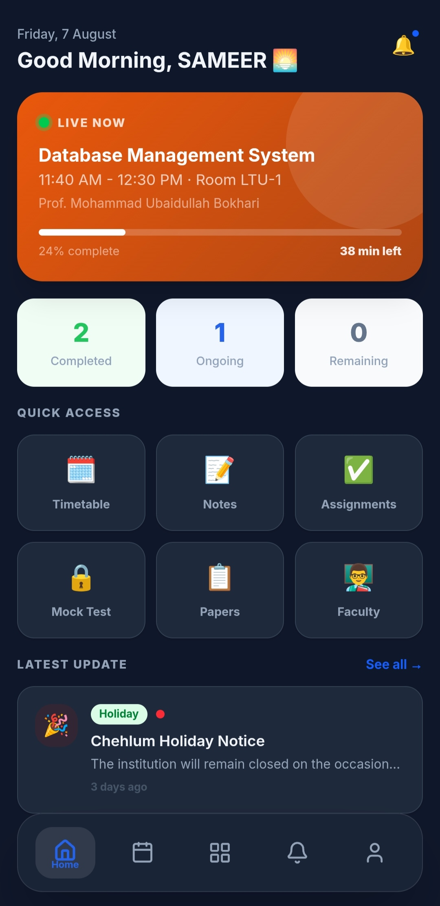
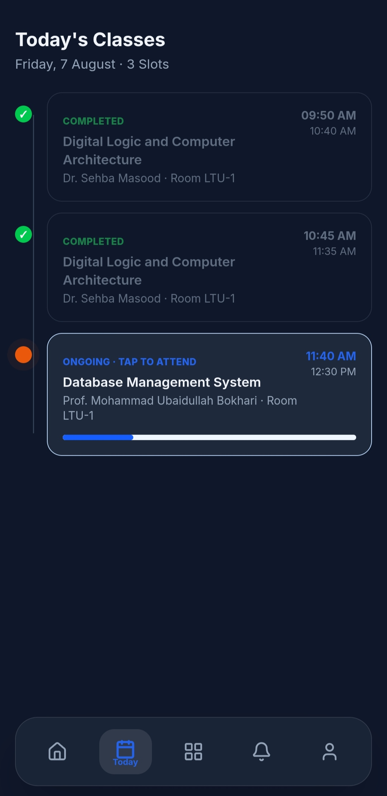
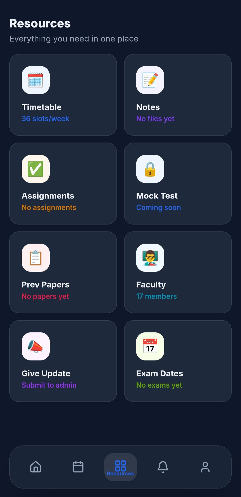
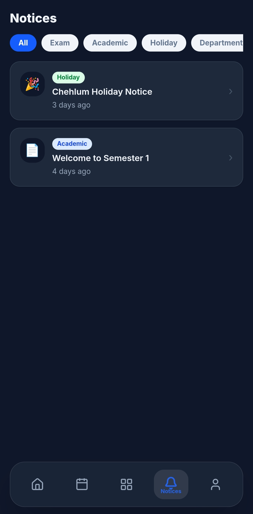
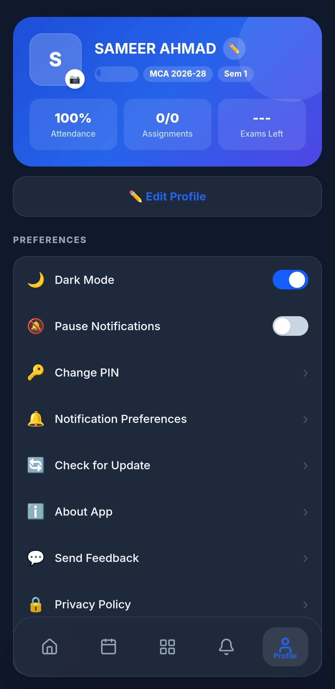

# 🎓 Batch 26

### Companion App for Aligarh Muslim University (AMU) MCA Batch 2026–2028

Stay connected with your academic journey through smart timetables, live class updates, notices, assignments, faculty information, exam schedules, and real-time notifications.

  
  
  
  
  
  

---

## 📥 Download

### 🚀 Latest APK

**Direct Download**

https://github.com/sameerahmad005/Batch-26/releases/download/app/batch-26_v1.0.3.apk

Current Version: **v1.0.3**

---

## 🎬 Preview

  
  
  
  
  

---

# 📖 About

**Batch 26** is a dedicated companion application developed exclusively for **Aligarh Muslim University (AMU) MCA Batch 2026–2028**.

The app brings all important academic information into one place, helping students stay updated with lectures, class schedules, department notices, assignments, exam schedules, faculty details, and real-time academic updates.

Designed with a modern and intuitive interface, Batch 26 simplifies day-to-day academic life while providing a fast, reliable, and seamless mobile experience.

---

# ✨ Features

## 📅 Smart Timetable

- Semester-wise timetable
- Live class tracking
- Current, upcoming, and completed classes
- Automatic semester detection
- Offline timetable support
- Holiday detection
- Real-time timetable updates

## 🔔 Smart Notifications

- 5-minute class reminders
- Class started alerts
- Department notices
- Assignment notifications
- Exam reminders
- Class change alerts
- General announcements

## 📚 Academic Resources

- Timetable
- Study notes
- Assignments
- Exam schedule
- Faculty directory

## 👨‍🏫 Faculty Directory

- Faculty profiles
- Contact information
- Phone numbers
- Email addresses
- Multiple faculty support
- Faculty photos

## 📢 Department Notices

- Academic notices
- Important announcements
- Priority notices
- Attachments
- Relative timestamps
- Real-time updates

## 📝 Class Reporting

Students can report:

- Class Cancelled
- Class Delayed
- Room Changed

Includes:

- Community voting
- Admin verification
- Live status updates
- Instant notifications

## 🗓 Exam Schedule

- Complete exam timetable
- Subject details
- Examination hall
- Date and time
- Countdown

## 🌙 Personalization

- Light theme
- Dark theme
- Notification preferences
- Pause notifications
- Offline mode
- Profile management

---

# ⚡ Highlights

- Modern Material Design
- Offline-first architecture
- Smart caching
- Real-time synchronization
- Firebase push notifications
- Local notifications
- Fast and lightweight
- Secure authentication
- Responsive UI

---

# 📱 App Screens

- Home
- Today
- Resources
- Timetable
- Notices
- Faculty Directory
- Assignments
- Exam Schedule
- Profile
- Settings
- Notice Details
- Faculty Details
- Class Details

---

# 🌐 Offline Support

Batch 26 continues working even without an internet connection.

Available offline:

- Timetable
- Today’s classes
- Faculty directory
- Exam schedule
- Cached academic data

When the internet becomes available, the application automatically synchronizes with the latest data.

---

# 🔒 Security

Security features include:

- Secure PIN authentication
- Hashed PIN storage
- Protected database access
- Secure communication
- User authentication
- Data validation

---

# 🚀 Performance

- Optimized loading
- Fast startup
- Local caching
- Smooth animations
- Lightweight assets
- Battery-friendly
- Responsive design

---

# 📥 Installation

1. Download the latest APK from the link above.
2. Enable **Install from Unknown Sources** if prompted.
3. Install the application.
4. Open the app.
5. Log in using your enrollment number.
6. Complete Quick Setup.

---

# 📋 Requirements

- Android 8.0 (API 26) or above
- Internet connection for real-time features
- Notification permission for reminders
- Approximately 100 MB free storage

---

# 🐞 Feedback

Found a bug or have a feature request?

Please open an **Issue** in this repository.

Your feedback helps improve future releases.

---

# 📄 Disclaimer

Batch 26 is an independent student companion application developed for **AMU MCA Batch 2026–2028**.

This project is **not an official application of Aligarh Muslim University (AMU)** and is **not affiliated with or endorsed by the University**.

Students should always verify official academic information through university notifications and announcements.

---

# 👨‍💻 Developer

**Sameer Ahmad**

🌐 Website  
https://sameerahmadansari.me

💻 GitHub  
https://github.com/sameerahmad005

💼 LinkedIn  
https://linkedin.com/in/sameer-abrar

---

# 📜 License

This project is licensed under the **MIT License**.

See the **LICENSE** file for details.

---

## 🧰 Technology Used

### Programming Languages

  
  
  
  

### Frontend

  
  
  
  
  

### Mobile Development

  
  
  
  

### Backend as a Service (BaaS)

  
  
  
  

### Authentication & Security

  
  
  
  

### Push Notifications

  
  
  
  

### Offline Storage

  
  
  
  

### Android Native APIs

  
  
  
  

### App Update System

  
  
  
  

### Update & Release Tools

  
  
  

### UI & UX

  
  
  
  

### UX Patterns

  
  
  
  

### State Management

  
  
  
  

### Libraries & Tooling

  
  
  
  

### Platform Tools

  
  
  
  

### Development Environment

  
  
  
  

### Architecture

  
  
  
  

  
  
  

---

### ⭐ If you find this project useful, consider starring the repository.

Made with ❤️ for **AMU MCA Batch 2026–2028**

